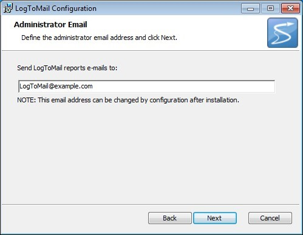

# Install

Navigate to [http://www.softfluent.com/product/logtomail/#section-getting-started](http://www.softfluent.com/product/logtomail/#section-getting-started).

The setup application will need internet access. The actual LogToMail application does not require it, after setup.

## Download and execute the setup

## Accept End-User License Agreement

## Set the destination folder

## Activate the product using your license key

A trial license key is available on our web site:
[http://www.softfluent.com/product/logtomail/#section-getting-started](http://www.softfluent.com/product/logtomail/#section-getting-started).

If you have purchased LogToMail, log in your account on [www.softfluent.com](www.softfluent.com) and you will find your license key on your products page.

*__Note__: Due to the technology used for the setup itself, pasting a product key does not enable the __Next__ button. In this scenario, you have to hit TAB, or bring the focus to the __Back__ button, which will then enable the __Next__ button.*

## Specify the adress you want the notification emails to be sent

The configuration file will be customized with this email address. Obviously, you can change this later at any time, by editing the configuration file LogToMail.exe.config. See section Settings for more information.

Next, next, next you're done !

After setup, files are deployed in the specified installation directory
(*%ProgramFiles(x86)%\SoftFluent\LogToMail* by default) and the service installed on your machine.

As you can see the service is stopped by default, so you can configure it before actually running it.

Refer to the **Settings** section for more information.

Most common reason for Setup to fail is invalid license key. Unfortunately, the error message is not always explicit. Please contact [support@softfluent.com](support@softfluent.com) to get help if needed.