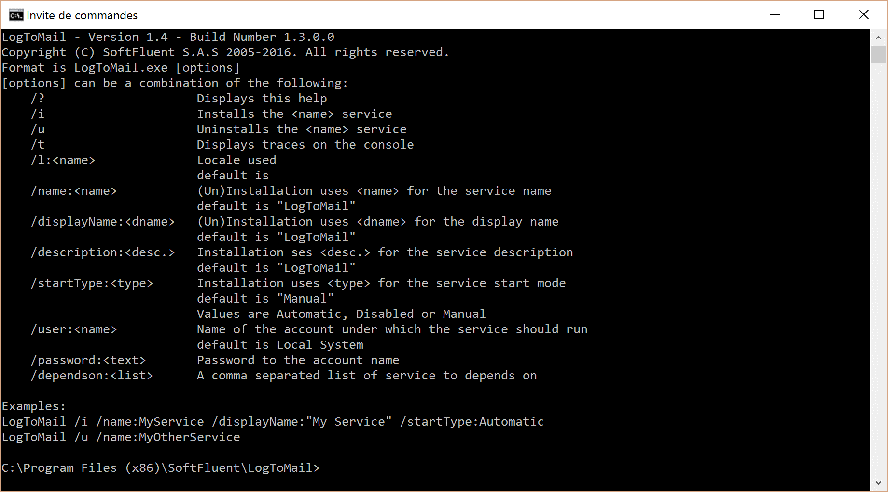

# Running as a Windows service

Once you are satisfied with your rules in test mode, it’s time to run LogToMail as a service. From the commande line, run LogToMail.exe /i.

**Syntaxe**: LogToMail /i /name:MyService /displayName:"My Service" /startType:Automatic

To unregister the service from Windows, just type LogToMail.exe /u.

