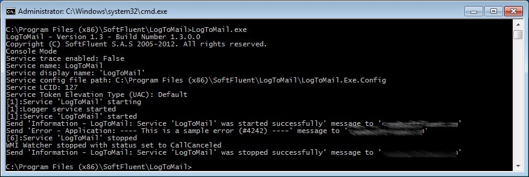

# Testing from the command line

Write your new rule(s) in the configuration file, then launch LogToMail.exe from a console application: all information is displayed on the console making it easier to troubleshoot.

